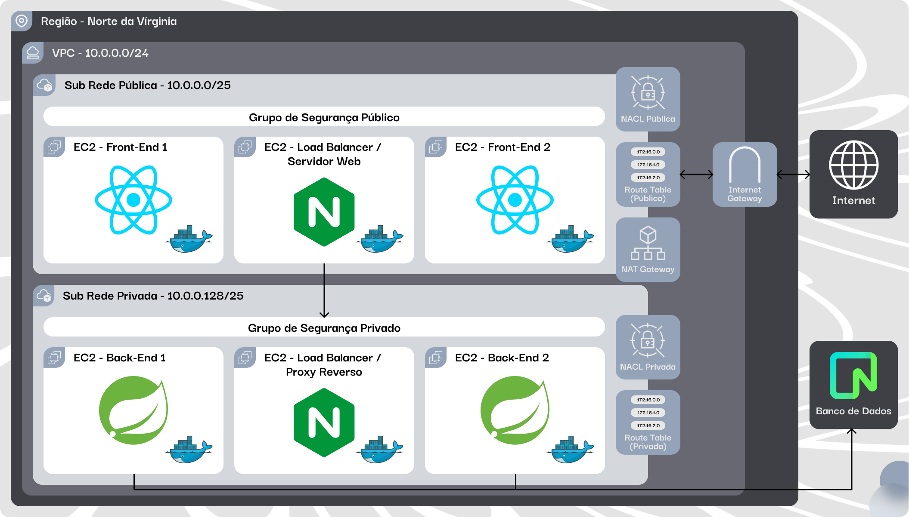
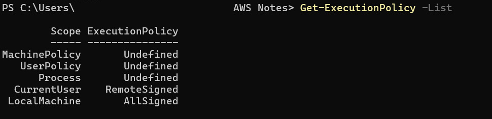

<p align="center">
  
  <h2 align="center">Bubbles AWS Architecture</h2>
  <p align="center">Segurança e eficiência com AWS e Terraform para sua aplicação!</p>
</p>

<p align="center">
  <a href="/docs/readme_pt-BR.md">Português</a> · <a href="/docs/readme_en.md">English</a>
</p>

# 🔍Índice <!-- omit in toc -->
- [Visão Geral](#visão-geral)
  - [Rede](#rede)
  - [Segurança](#segurança)
  - [Instâncias](#instâncias)
  - [Desenho da Arquitetura](#desenho-da-arquitetura)
- [Tecnologias](#tecnologias)
- [Guia de Instalação](#guia-de-instalação)
- [Como Usar o Projeto?](#como-usar-o-projeto)
- [Recursos Adicionais](#recursos-adicionais)

# 📝Visão Geral

<p align="left">
  Este repositório é dedicado para os arquivos da arquitetura da Bubbles na AWS. O objetivo destes arquivos é fornecer uma solução completa e eficiente para hospedar nossa aplicação        web desenvolvida com React e Typescript, e da nossa API REST desenvolvida com SpringBoot, priorizando alta disponibilidade, balanceamento de carga e segurança. <br><br>
  O Terraform, busca automatizar a criação e configuração de toda a infraestrutura na AWS, incluindo:
</p>

### **🛜Rede**:
  * **VPC**: Define o espaço de rede isolado na AWS onde todos os recursos serão executados.
  * **Sub-rede pública**: Hospeda recursos acessíveis pela internet, como o gateway Nginx e as instâncias de front-end.
  * **Sub-rede privada**: Hospeda recursos internos, protegidos do acesso direto da internet, como as instâncias de back-end e o load balancer do back-end.
  * **Internet Gateway**: Conecta a VPC à internet pública, permitindo que os recursos públicos sejam acessíveis.
  * **Tabela de rota pública**: Direciona o tráfego para a internet através do Internet Gateway.
  * **Tabela de rota privada**: Direciona o tráfego para a internet através do NAT Gateway.
  * **Associações de Tabelas de Rota**: Vinculam as tabelas de rota às sub-redes correspondentes, definindo como o tráfego flui dentro de cada sub-rede.
  * **NAT Gateway**: Permite que as instâncias na sub-rede privada acessem a internet.
  * **Elastic IP do NAT Gateway**: Garante que o NAT Gateway tenha um endereço IP consistente para comunicação externa.
  * **Elastic IP da Instância Gateway**: Garante que a istância Gateway tenha um endereço IP consistente para comunicação externa.
  * **ACLs de Rede**: Atuam como um firewall adicional para as sub-redes, controlando o tráfego de rede com base em regras específicas, adicionando uma camada extra de segurança.
### **🔒Segurança**:
  * **Grupo de segurança público**: Permite tráfego HTTP, HTTPS, SSH e tráfego na porta 8080 de qualquer lugar.
  * **Grupo de segurança privado**: Permite tráfego HTTP, SSH e tráfego na porta 8080 de qualquer lugar.
### **💾Instâncias**:
  * **Gateway (Nginx)**: Balanceador de carga do front-end, direciona o trafégo para o load balancer do back-end. Possui um IP Elástico.
  * **Front-End (2 Instâncias)**: Hospedam a interface do usuário da aplicação, servindo o conteúdo estático e interagindo com o backend.
  * **Load Balancer do Back-End**: Distribui as requisições recebidas entre as instâncias backend, garantindo alta disponibilidade e escalabilidade para a API.
  * **Back-End (2 Instâncias)**: Executam a lógica da aplicação, processando dados, interagindo com o banco de dados e fornecendo respostas para os frontends.

### **🎨Desenho da Arquitetura**


# <div align="center">👨‍💻Tecnologias</div>

<div align="center">
  
</div>

# <div align="center">📖Guia de Instalação</div>
### 🪟Windows:
1. Para executar o terraform no Windows, é necessário ter instalado o chocolatey (Gerenciador de pacotes para Windows). Site oficial para Download: https://chocolatey.org/ 
2. É altamente recomendado ter um editor de texto como o Visual Studio Code, ele facilitará a visualização do código Terraform, shell e já vem com um terminal integrado para execução dos comandos. Site oficial para Download: https://code.visualstudio.com/download
3. Para executar os comandos do chocolatey e do terraform é necessário que as politícas de execução do Windows estejam na seguinte configuração: 
  - Caso não estejam assim, siga este guia: https://learn.microsoft.com/en-us/powershell/module/microsoft.powershell.security/set-executionpolicy?view=powershell-7.4
4. Use o comando a seguir para instalar o terraform:
```choco install terraform``` 
5. Instale também o Docker Desktop para Windows. Site oficial para Download: https://www.docker.com/products/docker-desktop/

### 🐧Linux:

### 🍎MacOS:

# <div align="center">💡Como Usar o Projeto?</div>
# <div align="center">🔗Recursos Adicionais</div>
1. Aplicativos:
  - Visual Studio Code: https://code.visualstudio.com/download
  - DockerHub: https://www.docker.com/products/docker-desktop/

2. Linguagens e pacotes:  
  - Chocolatey: https://chocolatey.org/ 
  - Terraform: https://developer.hashicorp.com/terraform/tutorials/aws-get-started/install-cli
