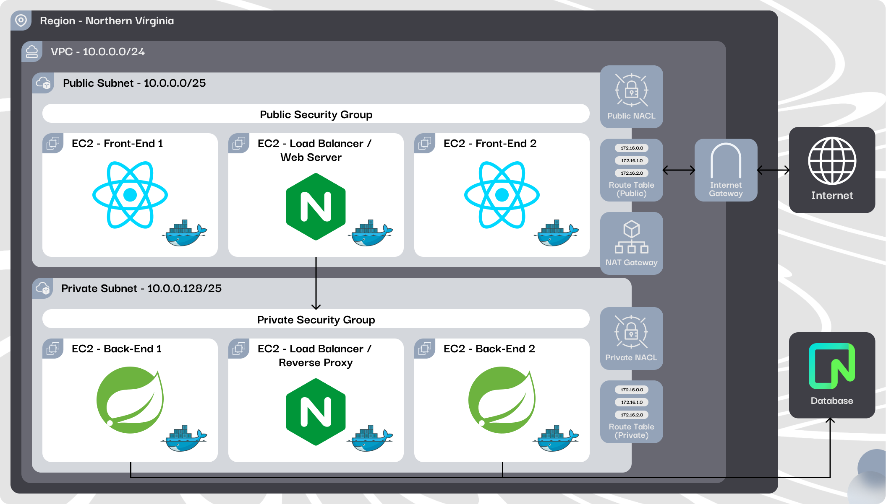

<p align="center">
  
  <h2 align="center">Bubbles AWS Architecture</h2>
  <p align="center">Security and efficiency with AWS e Terraform for your application!</p>
</p>

<p align="center">
  <a href="../README.md">Portuguese</a> · <a href="#">English</a>
</p>

# 🔍Summary <!-- omit in toc -->
- [Technologies](#technologies)
- [Overview](#overview)
  - [Network](#network)
  - [Security](#security)
  - [Instances](#instances)
  - [Architecture Design](#architecture-design)
- [Installation Guide](#installation-guide)
  - [Chocolatey](#chocolatey)
- [How to Use the Project?](#how-to-use-the-project)
- [Additional Resources](#additional-resources)
  - [Tools](#tools)
  - [Languages and Packages](#languages-and-packages)
  - [Reference Guide](#reference-guide)

# 💻Technologies
<table align="center"><tr>
  <td valign="top" width="20%">

  #### <div align="center">Cloud Platform</div>
  <p align="center">
    
  </p>
  <br>
  </td>

  <td valign="top" width="20%">

  #### <div align="center">Operating System</div>
  <p align="center">
    
  </p>

  </td>
  
  <td valign="top" width="20%">

  #### <div align="center">Infrastructure as Code</div>
  <p align="center">
    
  </p>

  </td>

  <td valign="top" width="20%">

  #### <div align="center">Containerization and Orchestration</div>
  <p align="center">
    
  </p>

  </td>
  
  <td valign="top" width="20%">

  #### <div align="center">Web Server and Reverse Proxy</div>
  <p align="center">
    
  </p>

  </td>
</tr></table>


# 📝Overview
  The Bubbles AWS Architecture is designed to provide a robust, secure and escalable solution for hosting the <a href="https://github.com/Projeto-Bubbles/bubbles-website-app" target="_blank">Bubbles Website</a> and <a href="https://github.com/Projeto-Bubbles/bubbles-spring-api-backend" target="_blank">Bubbles API</a>. By combining the power of AWS with Terraform automation, this repository supplies the necessary files to create and configure a complete infrastructure that prioritizes high availability, load balancing and security. The architecture is organized around three fundamental pillars.

### **🛜Network**
  Ensures secure and efficient isolation, connectivity and routing of resources.

  * **VPC:** Defines the isolated network space on AWS where all resources will run.
  * **Public Subnet:** Hosts internet-accessible resources, such as Nginx gateway and front-end instances.
  * **Private Subnet:** Hosts internal resources, protected from direct internet access, such as back-end instances and the back-end load balancer.
  * **Internet Gateway:** Connects the VPC to the public internet, allowing public resources to be accessible.
  * **Public Route Table:** Directs traffic to the internet through the Internet Gateway.
  * **Private Route Table:** Directs traffic to the internet through the NAT Gateway.
  * **Route Table Associations:** Link the route tables to the corresponding subnets, defining how traffic flows within each subnet.
  * **NAT Gateway:** Enables instances in the private subnet to access the internet.
  * **NAT Gateway Elastic IP:** Ensures that the NAT Gateway has a consistent IP address for external communication.
  * **Gateway Instance Elastic IP:** Ensures that the Gateway instance has a consistent IP address for external communication.
  * **Network ACLs:** Act as an additional firewall for the subnets, controlling network traffic based on specific rules, adding an extra layer of security.

### **🔒Security**
  Implements strict policies to protect both the front-end and back-end against threats.

  * **Public Security Group:** Allows HTTP, HTTPS, SSH and port 8080 traffic from anywhere.
  * **Private Security Group:** Allows HTTP, SSH and port 8080 traffic from anywhere.

### **💾Instances**
  Manages the execution of application components, ensuring proper resource allocation and optimized performance.

  * **Gateway (Nginx):** Routes traffic to the back-end load balancer. It has an elastic IP.
  * **Front-End (2 Instances):** Host the application's user interface, serving static content and interacting with the back-end.
  * **Load Balancer (Nginx):** Distributes incoming requests among the back-end instances, ensuring high availability and scalability for the API.
  * **Back-End (2 Instances):** Execute the application logic, processing data, interacting with the database and providing responses to the front-end.

### **🎨Architecture Design**
  Designed to maximize security and efficiency by isolating different application components according to their functions and access needs, while also providing high availability and resilience for the application's infrastructure.

  

  
  The diagram above illustrates the Bubbles application architecture, highlighting the separation and security of resources within a VPC (Virtual Private Cloud) in the Northern Virginia region. The infrastructure is divided into public and private subnets, each configured to serve different parts of the application:

  - Public Subnet (10.0.0.0/25): Hosts the front-end components and the Nginx load balancer, allowing users to access the application via the internet. The Internet Gateway connects this subnet to the internet, while a Public Route Table ensures traffic is properly routed. This subnet is protected by a Public Security Group, which controls access to the exposed resources. <br>

  - Private Subnet (10.0.0.128/25): Dedicated to critical back-end components, such as the Spring Boot instances that handle the application logic. Internet access, when necessary, is provided through the NAT Gateway, keeping resources protected from direct external access. The Private Route Table and Private Network ACLs (NACL) reinforce the security of this subnet. Resources in this area are governed by a Private Security Group that strictly limits allowed traffic. <br>

  - Interconnections and Security: The front-end and back-end instances communicate internally, with traffic carefully filtered by specific security groups. The diagram also highlights the use of Elastic IPs, ensuring that network gateways maintain consistent IP addresses, which are essential for external communication.

# 📖Installation Guide
  For this tutorial, we assume that Terraform and AWS CLI are already installed and configured on your machine. If you need installation instructions, please refer to the [Additional Resources](#additional-resources) section at the end of the document.

  * **Warning:** If you installed Terraform via Chocolatey (Windows Package Manager), encountered issues with the traditional Windows installation, or want to try an alternative approach, follow the specific instructions in the [Chocolatey](#chocolatey) section. This step is optional and depends on your setup environment.

1. **Obtain AWS Credentials** <br>
  Before starting to set up the environment, you will need AWS credentials to access the required services. If you are using a lab or temporary environment, access the terminal and run the command below to display the credentials:
    - **Warning:** These credentials may change each time you start a new lab or session. Make sure to obtain new credentials every time you begin a new lab. <br><br>
    ```
    cat ~/.aws/credentials
    ```

2. **Configure the AWS CLI** <br>
  With your credentials ready, you need to configure the AWS CLI (Command Line Interface) to interact with AWS. This can be done using any terminal, such as PowerShell, Bash, or CMD. Enter the command below in the terminal and follow the prompts to input the Access Key, Secret Key, and desired region:
    ```
    aws configure
    ```

3. **Setting Keys, Region, Session, and Token**
    1. **AWS Access Key ID** <br>
      Enter the access key obtained in the previous step.
    2. **AWS Secret Access Key** <br>
      Enter the corresponding secret key.
    3. **Default region name** <br> 
      Specify the region (e.g., us-east-1).
    4. **Default output format** <br>
      Set to json or another format of your choice.
    5. **(Optional, if applicable) Set the Session Token** <br>
      If you need a session token (commonly used in temporary or secure environments), use the command below to configure it, and replace `<<token>>` with the session token value provided.<br><br>
        ```
        aws configure set aws_session_token <<token>>
        ``` 

4. **Initialize Terraform** <br> 
  With the AWS CLI configured, the next step is to prepare Terraform to manage the infrastructure. To do this, you need to download all necessary providers and set up the working environment for Terraform. In the root directory of your project, run the following command:
    ``` 
    terraform init
    ```    

5. **Apply Terraform Configuration** <br>
  After initialization, you are ready to create or update the infrastructure on AWS. To apply the configurations defined in the .tf files and provision the infrastructure on AWS, use the following command:
    ```
    terraform apply
    ```

6. **Review and Confirm** <br>
  Terraform will present a summary of the changes that will be made. Review the changes, and if you agree, confirm by typing `yes` when prompted.

  ### 🍫Chocolatey
  To manage the installation of Terraform using Chocolatey, follow the steps below. We recommend using <a href="https://code.visualstudio.com/download">Visual Studio Code</a> to facilitate viewing Terraform code and running commands in the integrated terminal. Note that this step does not eliminate the need to install the <a href="https://docs.aws.amazon.com/pt_br/cli/latest/userguide/getting-started-install.html">AWS CLI</a>.
  
  1. **Configuring Windows Execution Policies** <br> 
    To run Chocolatey and Terraform commands, ensure that Windows execution policies are set up correctly. The policies should be configured as shown in the image below: 

      - If they are not configured this way, follow <a href="https://learn.microsoft.com/en-us/powershell/module/microsoft.powershell.security/set-executionpolicy?view=powershell-7.4">this guide</a> to adjust them.

  2. **Installing Chocolatey** <br> 
    Install Chocolatey by following the instructions on the <a href="https://chocolatey.org/">official website</a>.
  
  3. **Installing Terraform with Chocolatey** <br> 
    Open the Windows terminal (PowerShell, Bash, Visual Studio Code integrated terminal, etc.) and run the following command to install Terraform:
      ```
      choco install terraform
      ```

  4. **Obtain AWS Credentials** <br> 
    In the AWS lab terminal, run the command below to display your credentials:
      - **Warning:** These credentials may change each time you start a new lab or session. Make sure to obtain new credentials every time you begin a new lab. <br><br>
      ```
      cat ~/.aws/credentials
      ```

  5. **Configuring Credentials on Windows** <br> 
    Navigate to the directory `C:\Users\[your_username]\.aws` using File Explorer or the terminal. In this location, you will find two files: config and credentials. Edit the files as described below:
      * `config`
        ```
          [default]
          region = a
          output = a
        ``` 
      * `credentials`
        ```
          <<credenciais-da-aws>>
        ```

  6. **Initializing Terraform** <br> 
    Now, in the terminal, navigate to the directory where the main.tf file is located. If you are using Visual Studio Code, you can easily navigate to the directory. Initialize Terraform with the command:
      ```
      terraform init
      ```

  7. **Apply Terraform Configuration** <br> 
    After initialization, you are ready to create or update the infrastructure on AWS. To apply the configurations defined in the .tf files and provision the infrastructure on AWS, use the command:
      ```
      terraform apply
      ```

  8. **Review and Confirm** <br> 
    Terraform will present a summary of the changes that will be made. Review the changes, and if you agree, confirm by typing yes when prompted.

# 💡How to Use the Project?
Após configurar o ambiente na nuvem com sucesso, você pode começar a usar a infraestrutura provisionada para hospedar suas aplicações. Abaixo estão alguns exemplos de como aproveitar os recursos e funcionalidades fornecidos pelo Bubbles AWS Architecture:

### 🖌️Implantação do Front-End
  * Upload de Código: Faça o upload do seu código front-end (HTML, CSS, JavaScript) para as instâncias EC2 configuradas para o front-end. Utilize o SCP ou o Git para transferir os arquivos para o servidor.
  * Configuração do Nginx: O Nginx já está pré-configurado como balanceador de carga para distribuir o tráfego entre as instâncias. Você pode ajustar as configurações no arquivo nginx.conf se necessário.

### 🫧Implantando a API Back-End
  * Deploy da API: Faça o deploy da sua API nas instâncias de back-end, utilizando ferramentas como Jenkins ou simplesmente configurando o CI/CD no seu repositório GitHub para deployment automático.
  * Configuração do Load Balancer: O Load Balancer do back-end foi configurado para distribuir as requisições entre as instâncias de back-end, assegurando alta disponibilidade. Verifique a saúde das instâncias via AWS Console.
### 📈Monitoramento e Escalabilidade
  * Escalabilidade: Se houver necessidade de escalar a aplicação, você pode ajustar a quantidade de instâncias diretamente pelo Terraform ou pelo AWS Auto Scaling. A arquitetura está preparada para suportar esse tipo de ajuste.
### 👷🏼Testes e Verificação
  * Teste de Conectividade: Verifique se os endpoints da sua aplicação (front-end e API) estão acessíveis e funcionando conforme o esperado. Utilize ferramentas como curl ou Postman para testar os endpoints e verificar as respostas.
  * Auditoria de Segurança: Execute auditorias de segurança para garantir que as políticas de grupo de segurança e ACLs estejam devidamente configuradas. Utilize o AWS Inspector ou outras ferramentas de segurança.
### 🔨Atualizações e Manutenção
  * Atualização de Infraestrutura: Para modificar ou atualizar a infraestrutura, edite os arquivos .tf e aplique as mudanças usando: ```terraform apply```. Isso permitirá que você adicione novos recursos ou altere a configuração existente sem afetar a disponibilidade do sistema.
  * Manutenção Programada: Configure janelas de manutenção para aplicar patches de segurança ou atualizar o sistema operacional das instâncias. Utilize o AWS Systems Manager para automação dessas tarefas.

# 🔗Additional Resources
### 🔧Tools
  - <a href="https://code.visualstudio.com/download">Visual Studio Code</a>
  - <a href="https://www.docker.com/products/docker-desktop/">DockerHub (Windows)</a>

### 📦Languages and Packages
  - <a href="https://developer.hashicorp.com/terraform/tutorials/aws-get-started/install-cli">Terraform</a>
  - <a href="https://chocolatey.org/">Chocolatey (Windows)</a> 
  - <a href="https://docs.aws.amazon.com/pt_br/cli/latest/userguide/getting-started-install.html">AWS CLI</a>

### 📖Reference Guide
  - <a href="https://learn.microsoft.com/en-us/powershell/module/microsoft.powershell.security/set-executionpolicy?view=powershell-7.4">Alterar Credenciais do Usuário (Windows e Mac)</a>
